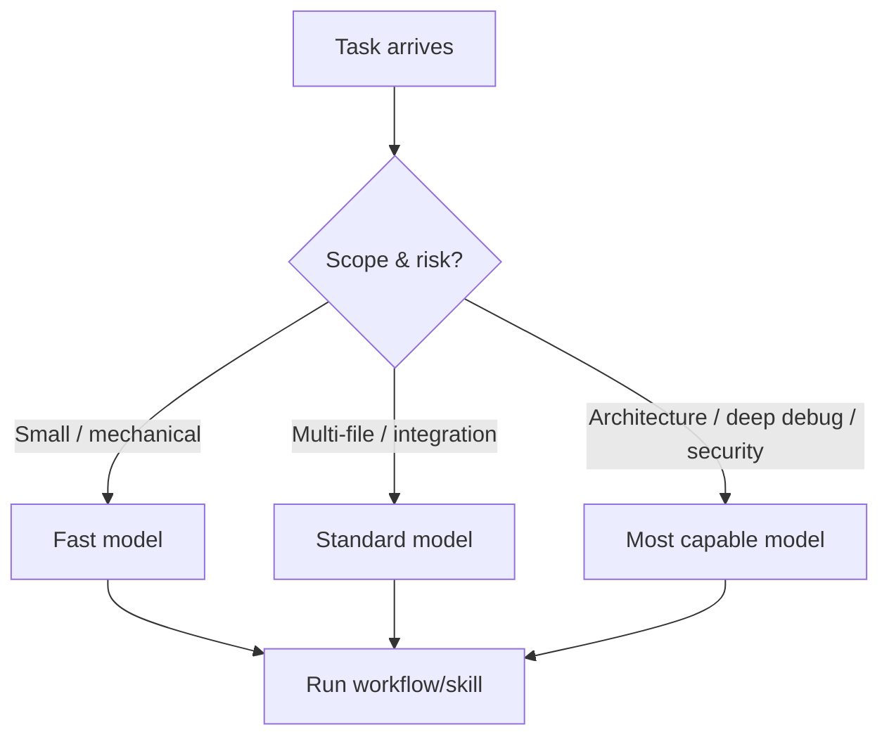

# Visual Summary

## The operating loop

```mermaid
flowchart LR
  A[/plan] --> B[/tdd or Fast]
  B --> C[/review]
  B --> D[/debug]
  D --> B
  C --> E[/close-session]
  E --> F[/new-knowledge-item (optional)]
```

## The model selection overlay


